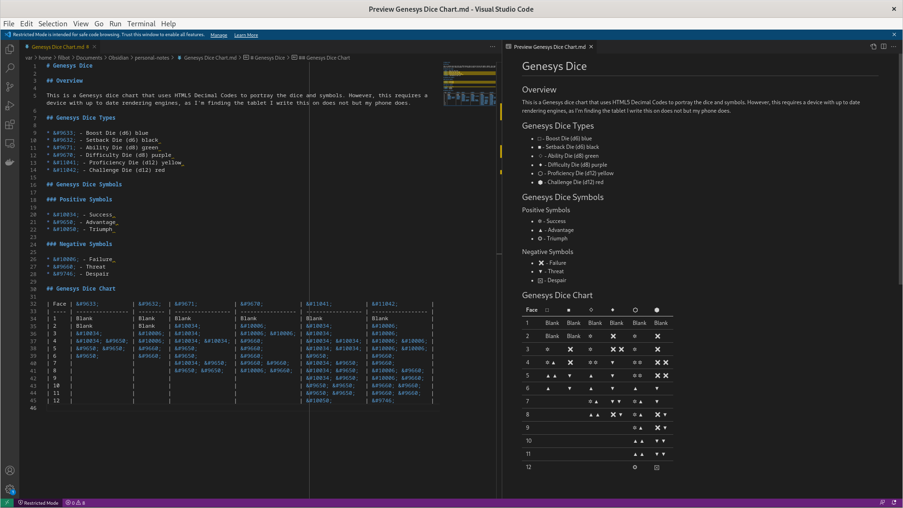

# Genesys Dice

## Overview

This is a Genesys dice chart that uses HTML5 Decimal Codes to portray the dice
and symbols. However, this requires a device with up to date rendering engines,
as I'm finding the tablet I write this on does not but my phone does.

## Genesys Dice Types

* &#9633; - Boost Die (d6) blue
* &#9632; - Setback Die (d6) black
* &#9671; - Ability Die (d8) green
* &#9670; - Difficulty Die (d8) purple
* &#11041; - Proficiency Die (d12) yellow
* &#11042; - Challenge Die (d12) red

## Genesys Dice Symbols

### Positive Symbols

* &#10034; - Success
* &#9650; - Advantage
* &#10050; - Triumph

### Negative Symbols

* &#10006; - Failure
* &#9660; - Threat
* &#9746; - Despair

## Genesys Dice Chart

| Face | &#9633;          | &#9632;  | &#9671;           | &#9670;           | &#11041;          | &#11042;          |
| ---- | ---------------- | -------- | ----------------- | ----------------- | ----------------- | ----------------- |
| 1    | Blank            | Blank    | Blank             | Blank             | Blank             | Blank             |
| 2    | Blank            | Blank    | &#10034;          | &#10006;          | &#10034;          | &#10006;          |
| 3    | &#10034;         | &#10006; | &#10034;          | &#10006; &#10006; | &#10034;          | &#10006;          |
| 4    | &#10034; &#9650; | &#10006; | &#10034; &#10034; | &#9660;           | &#10034; &#10034; | &#10006; &#10006; |
| 5    | &#9650; &#9650;  | &#9660;  | &#9650;           | &#9660;           | &#10034; &#10034; | &#10006; &#10006; |
| 6    | &#9650;          | &#9660;  | &#9650;           | &#9660;           | &#9650;           | &#9660;           |
| 7    |                  |          | &#10034; &#9650;  | &#9660; &#9660;   | &#10034; &#9650;  | &#9660;           |
| 8    |                  |          | &#9650; &#9650;   | &#10006; &#9660;  | &#10034; &#9650;  | &#10006; &#9660;  |
| 9    |                  |          |                   |                   | &#10034; &#9650;  | &#10006; &#9660;  |
| 10   |                  |          |                   |                   | &#9650; &#9650;   | &#9660; &#9660;   |
| 11   |                  |          |                   |                   | &#9650; &#9650;   | &#9660; &#9660;   |
| 12   |                  |          |                   |                   | &#10050;          | &#9746;           |

## Example

